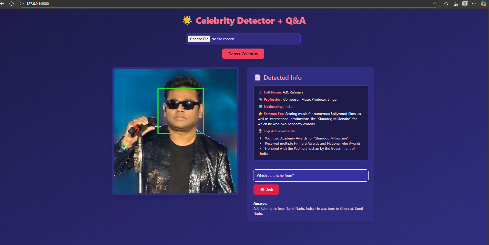
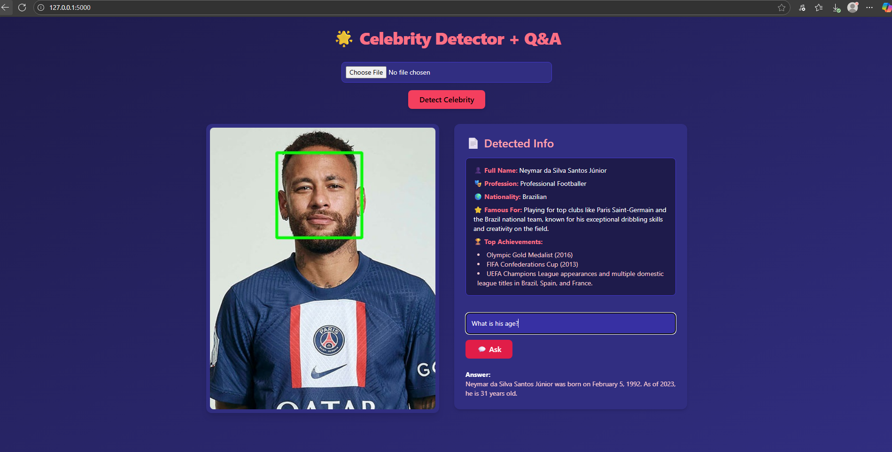
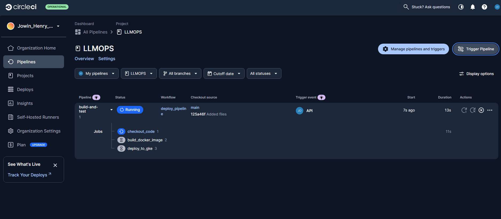
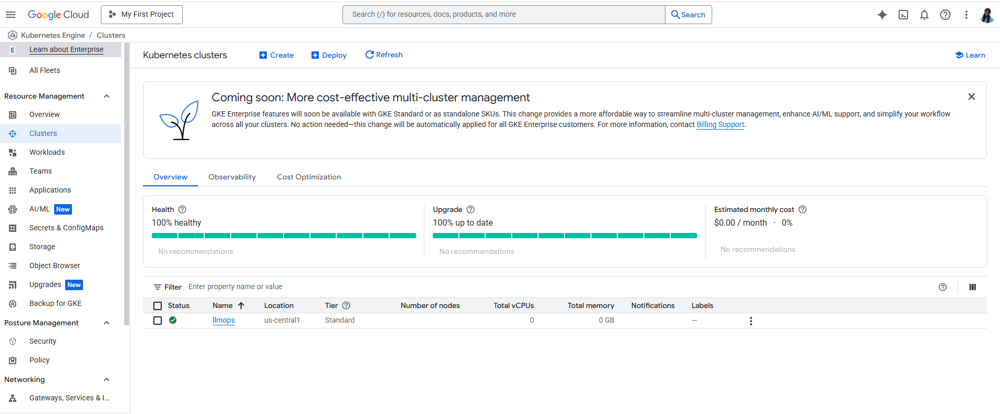

# 🎬 Celebrity Detector & Q&A 🤖

This project combines state-of-the-art **Large Language Models (LLMs)** to deliver an intelligent celebrity recognition and question-answering web app.

## 🌟 Overview

The app leverages **vision transformer-powered LLMs** (specifically Meta’s LLaMA 4 Scout 17B Instruct model hosted via Groq's API) to:

- 🖼️ **Recognize celebrities** in user-uploaded images by analyzing visual input and generating structured textual information.
- 💬 **Answer user questions** about the detected celebrity with concise, accurate, and context-aware responses.
- 🚀 **Use CI/CD pipelines** with CircleCI for automated testing, building, and deployment.
- ☁️ **Deploy containerized app** on Google Cloud Platform (GCP) using Kubernetes via Google Kubernetes Engine (GKE).
- 🛡️ **Enforce AI guardrails** to ensure safe, respectful, and privacy-preserving responses from the LLM.

## 📸 Screenshots

Here are some example snapshots of the app in action:

### 🔍 Celebrity Detection and Q&A



### 
Ask questions and get concise, LLM-powered answers:



## 🚀 Key Features

- 🤝 **Vision-Language Integration:** The model processes both image and text input by embedding the uploaded image in a prompt, allowing joint understanding.
- 🎭 **Celebrity Recognition:** The LLM identifies the person in the image and outputs detailed structured information (name, profession, nationality, achievements).
- ❓ **Conversational Q&A:** Users can ask follow-up questions about the recognized celebrity, which the LLM answers using a tailored prompt to ensure accuracy and relevance.
- 👁️‍🗨️ **Face Detection Preprocessing:** OpenCV’s Haar cascade detects faces, focusing recognition on the largest face to improve LLM input quality.

## 🏗️ Architecture

- 🌐 **Frontend:** A React/Flask web interface allows image upload and interaction.
- ⚙️ **Backend:**
  - `image_handler.py` preprocesses images and detects faces.
  - `celebrity_detector.py` sends images to the Groq API with the vision transformer LLM for celebrity identification.
  - `qa_engine.py` uses the same LLM to answer questions about the detected celebrity.
- 🤖 **LLM Model:** Uses the `meta-llama/llama-4-maverick-17b-128e-instruct` model, a vision-capable transformer with strong NLP abilities, enabling multimodal understanding.

## 🛡️ Guardrails for Safe and Respectful LLM Interaction

This project employs a custom **Guardrails XML specification** to control and validate the LLM’s behavior during Q&A, ensuring:

- **Input Parameters:** The guardrail takes the celebrity’s name and user’s question as structured inputs.
- **Output Constraints:** The LLM must generate a concise, safe, and respectful answer to the user’s question.
- **Response Instructions:**
  - Provide accurate and concise answers in full sentences.
  - Avoid private or unverified personal information.
  - Reject any questions requesting harmful, invasive, or disrespectful content.
  - Do not speculate on rumors or gossip.
- **Validation Rules:**
  - Output must conform to the expected schema.
  - Strict profanity filtering with re-prompting on failure.
  - Privacy filters block any mention of sensitive information such as phone numbers, addresses, emails, SSNs, etc.
  - Enforce a minimum length to ensure complete, informative sentences.
  
These guardrails help maintain **trust, safety, and quality** in user interactions by automatically enforcing ethical boundaries and factual correctness in all AI-generated responses.


## 🛠️ Installation & Setup

1. Clone the repo:
   ```bash
   git clone https://github.com/yourusername/celebrity-detector-qa.git
   cd celebrity-detector-qa
   ```

2. Create a virtual environment and install dependencies:

   ```bash
   python3 -m venv venv
   source venv/bin/activate
   pip install -r requirements.txt
   ```
3. Add your Groq API key to a `.env` file:

   ```
   GROQ_API_KEY=your_api_key_here

   ```
4. Run the app:

   ```bash
   python app.py
   ```
5. Visit `http://localhost:5000` in your browser.

## 🎯 Usage

* Upload an image containing a celebrity’s face.
* The system detects and highlights the largest face.
* The vision transformer LLM processes the image and returns detailed information about the celebrity.
* Ask follow-up questions in natural language; the LLM answers them based on the celebrity context.

Great — adding a **CI/CD & GCP deployment section** with your context will make your README much stronger and professional.
Here’s how you can integrate it into your README (I’ll keep the formatting and flow consistent with what you shared earlier):


## ⚙️ CI/CD & Deployment with CircleCI and GCP

This project is fully containerized and deployed on **Google Cloud Platform (GCP)** using **Google Kubernetes Engine (GKE)**, with continuous integration and delivery powered by **CircleCI**.

### ✅ Pre-Deployment Checklist

Make sure you’ve completed the following:

1. ✅ Created a **Dockerfile**  
2. ✅ Written a **Kubernetes Deployment file**  
3. ✅ Set up **code versioning** on GitHub  

---

### ✅ Enable Required GCP APIs

In your GCP Console:

- Navigate to **APIs & Services → Library**
- Enable:
  - Kubernetes Engine API  
  - Container Registry API  
  - Compute Engine API  
  - Cloud Build API  
  - Cloud Storage API  
  - IAM API  

---

### ✅ Create GKE Cluster and Artifact Registry

1. **GKE Cluster**
   - Search for **GKE** in the GCP Console
   - Create a new cluster (name of your choice)
   - Configure networking and access settings  

2. **Artifact Registry**
   - Search for **Artifact Registry**
   - Create a new registry for Docker images  

---

### ✅ Create a Service Account and Configure Access

1. Create a **Service Account** in GCP Console  
2. Assign these roles:
   - Storage Object Admin  
   - Storage Object Viewer  
   - Owner  
   - Artifact Registry Admin  
   - Artifact Registry Writer  
3. Download the key as `gcp-key.json`  
4. Place `gcp-key.json` in the root directory  
5. Add it to `.gitignore` to prevent accidental GitHub pushes  

---

### 🔐 Convert `gcp-key.json` to Base64

Run in your terminal:

```bash
cat gcp-key.json | base64 -w 0
````

Save the output for CircleCI environment variables.

---

### ✅ Set Up CircleCI Configuration

1. Create `.circleci/config.yml` in your project root
2. Connect CircleCI to your GitHub repository
3. Configure **workflows and pipelines**
4. Add environment variables in CircleCI under **Project Settings → Environment Variables**:

   * `GCLOUD_SERVICE_KEY` — Base64-encoded GCP key
   * `GOOGLE_PROJECT_ID` — your GCP project ID
   * `GKE_CLUSTER` — your cluster name
   * `GOOGLE_COMPUTE_REGION` — your region

---

### ✅ Set Up LLMOps Secrets in GKE

Use `kubectl` to create a Kubernetes secret for your Groq API key:

```bash
kubectl create secret generic llmops-secrets \
--from-literal=GROQ_API_KEY="your_actual_groq_api_key"
```

This ensures your application retrieves sensitive keys securely at runtime.

---

### ✅ Trigger CircleCI Pipeline

* Run the pipeline manually the first time in CircleCI to confirm setup.
* Afterward, each `git push` automatically triggers the pipeline to build, push, and deploy the app to GKE.

---

## 📸 Deployment Snapshots

### 🚀 CircleCI Pipeline in Action



### ☁️ Google Kubernetes Engine (GKE) Cluster Deployment



## Service Account setup


## 🔧 Technologies used

- **Large Language Model:** Meta LLaMA 4 Scout 17B with vision capabilities  
- **API Hosting:** Groq AI API for multimodal LLM inference  
- **Computer Vision:** OpenCV for face detection preprocessing
- **CI/CD:** CircleCI for automated testing and deployment  
- **Cloud Deployment:** Google Cloud Platform (GKE & Artifact Registry)  
- **Containerization:** Docker and Kubernetes    
- **Backend Framework:** Flask  
- **Frontend Styling:** Tailwind CSS  


---

